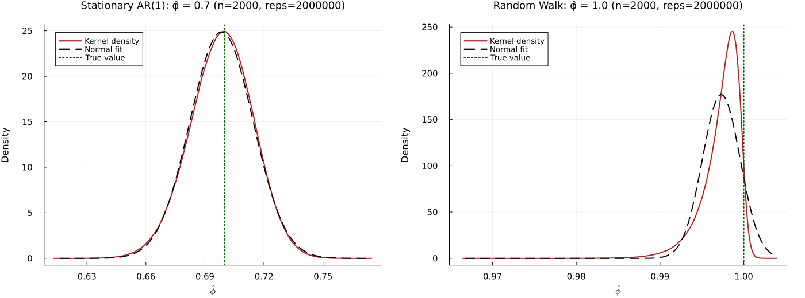

# Introduction

Time-series econometrics analyzes sequences of observations indexed by time and explicitly models temporal dependence. Time-series data commonly exhibit autocorrelation, non-stationarity, and seasonality. As a result, the standard i.i.d. assumptions often fail and require specialized methods. This handout summarizes core definitions and properties of stationary and integrated processes, and gives concise examples and illustrations.

Distinguishing stationary from integrated series is essential for choosing models and making valid inferences. Central to these ideas is the notion of a stochastic process, defined below.

\begin{definition}
Let $(\Omega,\mathcal{F},\mathbb{P})$ be a probability space, and let $T$ be an index set (often representing time, e.g. $T = \mathbb{N}$ for discrete time or $T = \mathbb{R}_{+}$ for continuous time).

A stochastic process is a family of random variables
$$\{X(\tau, \omega) : \tau \in T, \; \omega \in \Omega\}$$

such that for each fixed $\tau \in T$, the mapping
$$X(\tau, \cdot) : \Omega \to \mathbb{R}$$

is a random variable on $(\Omega, \mathcal{F}, \mathbb{P})$.
\end{definition}

Alternatively, we define a stochastic process as follows:

\begin{definition}
One can equivalently view a stochastic process as a function
$$X: \Omega \times T \to \mathbb{R},\qquad (\omega,\tau) \mapsto X(\omega,\tau),$$
where:

- For each $\tau \in T$, the mapping $X(\cdot,\tau):\Omega\to\mathbb{R}$ is measurable with respect to $\mathcal{F}$.

- For each $\omega\in\Omega$, the mapping $X(\omega,\cdot):T\to\mathbb{R}$ is a trajectory (sample path) of the process.
\end{definition}

**Key Perspectives**

• Random variable view: For each $\tau \in T$, $X(\tau)$ is a random variable.

• Sample path view: For each $\omega \in \Omega$, $X(\omega, \cdot)$ is a deterministic function of time.

• Distributional view: The finite-dimensional distributions $X(\tau_1), \ldots, X(\tau_n)$ for $\tau_1, \ldots, \tau_n \in T$ characterize the process.

Figure 1 illustrates the concept of a stochastic process through the simulation of multiple sample paths of a simple random walk, a canonical example within stochastic process theory. Each trajectory corresponds to a distinct realization of the process, associated with a particular outcome $\omega \in \Omega$. The figure depicts the temporal evolution of the process values across these realizations, thereby exemplifying the intrinsic randomness and variability that are fundamental characteristics of stochastic processes.

```{r, fig.cap="Multiple simple random-walk sample paths (5)", fig.width=6, fig.height=3, echo=FALSE}
# Simulate and plot 5 simple random walks (T = 500)
set.seed(2026)
T <- 500
n_paths <- 5

# Generate iid normal increments and form cumulative sums (simple random walks)
increments <- matrix(rnorm(T * n_paths, mean = 0, sd = 1), ncol = n_paths)
paths <- apply(increments, 2, cumsum)

# Prepare long dataframe for ggplot
df_paths <- data.frame(
  Time = rep(1:T, times = n_paths),
  Value = as.vector(paths),
  Omega = factor(rep(1:n_paths, each = T))
)

library(ggplot2)

# Use showtext to ensure glyphs (e.g. ω) are available in R graphics.
# NOTE: install required packages and fonts outside the document to avoid
# interactive installs during rendering. Recommended packages are listed in
# README.md.
library(showtext)
# If you want the Google font 'Noto Sans' available automatically, install
# it interactively (once) with: font_add_google("Noto Sans", "notosans").
showtext_auto()

ggplot(df_paths, aes(x = Time, y = Value, color = Omega, group = Omega)) +
  geom_line(size = 0.6) +
  labs(x = 'Time', y = expression(X[t](omega)), color = expression(omega)) +
  theme_bw() +
  theme(text = element_text(family = "serif"),
        legend.position = 'right',
        plot.title = element_text(hjust = 0.5)) +
    scale_color_discrete(labels = parse(text = paste0("omega[", 1:n_paths, "]"))) +
    scale_x_continuous(breaks = seq(1, T, by = 50))
```

A stochastic process formalizes "random evolution over time": given a probability space $(\Omega,\mathcal{F},\mathbb{P})$, the process assigns a random variable to each time point and, for a fixed outcome $\omega$, a deterministic sample path. Figure 1 illustrates multiple sample paths (realizations) of a simple random walk. Each trajectory corresponds to a distinct realization. The figure depicts the temporal evolution of the process values across these realizations. It exemplifies the intrinsic randomness and variability that are fundamental characteristics of stochastic processes.

```{r}
#| echo: false
#| include: false
#| warning: false
#| message: false
#| caption: "Simulated Stationary Time Series"
#| fig.cap: "A simulated stationary time series"
#| fig.width: 4
#| fig.height: 3
library(ggplot2)
set.seed(123)
n <- 100
library(ggpubr)  # Load ggpubr for theme_classic2

# Function to generate a stationary time series
# y_t = c + \phi *y_{t-1} + \epsilon_t
ar1_time_series <- function(n, c, phi) {
  # Generate white noise
  epsilon <- rnorm(n, mean = 0, sd = 1)
  
  # Initialize the time series
  y <- numeric(n)
  y[1] <- c + epsilon[1]  # Initial value
  
  # Generate the time series
  for (t in 2:n) {
    y[t] <- c + phi * y[t - 1] + epsilon[t]
  }  # Added missing closing brace
  
  return(y)
}  # Fixed brace placement

# Define n before using it
n <- 200  # Add this line
c <- 0.2  # Constant term
phi <- 0.6  # Autoregressive coefficient

# Generate an AR(1) time series
data <- data.frame(
  time = 1:n,
  time_series = ar1_time_series(n, c, phi)
)

# Plot the time series using ggplot2
ggplot(data, aes(x = time, y = time_series)) +
  geom_line(color = "navy") +
  labs(
    x = "Time",
    y = "Value"
  ) +
    theme_classic2() +
    theme(text = element_text(family = "serif"),
      plot.title = element_text(hjust = 0.5))

```

# Weak Stationarity

\begin{definition}[Weak (second-order) stationarity]
Let $\{X_t : t \in T\}$ be a stochastic process with finite second moments. The process is said to be weakly stationary (or second-order stationary) if:

1. $\mathbb{E}[X_t] = \mu$ for all $t \in T$ (the mean is constant), and
2. $\mathrm{Cov}(X_{t+h}, X_t) = \gamma(h)$ depends only on the lag $h$ (the autocovariance is a function of lag only), for all $t, h$ for which the moments exist.
\end{definition}

Equivalently, weak stationarity implies that $\mathrm{Var}(X_t)=\gamma(0)$ is constant over time. Many linear time-series models with finite variance (for example, ARMA models with appropriate coefficients) are weakly stationary. Weak stationarity is the common assumption used in spectral analysis, autocorrelation estimation, and linear forecasting methods.


Weak (or covariance) stationarity refers to a property of a time series whereby, notwithstanding its apparent randomness, its fundamental second-order characteristics remain invariant over time. Specifically, the mean of the series is constant, and the covariance between any two observations depends solely on the temporal distance (lag) separating them rather than on their specific positions in time. Intuitively, if one were to apply a fixed-length moving window across the series and compute summary statistics such as the mean, variance, and autocovariances at various lags (e.g., 1, 2, or 3), these measures would remain stable and exhibit no systematic drift as the window progresses along the time axis. The series does not exhibit systematic increases in level, heightened volatility, or alterations in its correlation structure over calendar time; rather, it persistently replicates an identical variance–covariance configuration. This condition constitutes a less stringent requirement than full (strong) stationarity, as it disregards the complete distributional form and instead concentrates exclusively on the first and second moments. Such a focus is frequently sufficient for linear modeling frameworks and for a wide range of practical time-series methodologies.


The figure below illustrates a simulated weakly stationary AR(1) process, which is a common example of a stationary time series. The plot demonstrates the constancy of the mean (indicated by the red dashed line) and the stable variance over time, visually confirming the properties of weak stationarity.

- Constancy of mean
- Stable variance

```{r, fig.cap="Simulated stationary AR(1) process (mean dashed)", fig.width=5, fig.height=3}
# Simulate a stationary AR(1) process
#| echo: false
set.seed(123)
n <- 500
phi <- 0.8
mu <- 5
sigma <- 1
x <- numeric(n)
x[1] <- rnorm(1, mean = mu, sd = sigma / sqrt(1 - phi^2))
for (t in 2:n) {
  x[t] <- mu + phi * (x[t-1] - mu) + rnorm(1, 0, sigma)
}
library(ggplot2)

mean_x <- mean(x)
sd_x <- sd(x)
upper_band <- mean_x + 2 * sd_x
lower_band <- mean_x - 2 * sd_x

ggplot(data.frame(Time = 1:n, Value = x), aes(Time, Value)) +
  geom_line(color = 'black', linewidth = 0.6) +
  geom_hline(yintercept = mean_x, linetype = 'dashed', color = 'red', linewidth = 1) +
  geom_hline(yintercept = upper_band, linetype = 'dotted', color = 'darkgreen', linewidth = 0.8) +
  geom_hline(yintercept = lower_band, linetype = 'dotted', color = 'darkgreen', linewidth = 0.8) +
  labs(y = expression(X(t)), x = 'Time') +
  theme_bw(base_size = 14) +
  theme(
    axis.title.x = element_text(size = 10),
    axis.title.y = element_text(size = 10),
    axis.text.x = element_text(size = 8),
    axis.text.y = element_text(size = 8)
  ) +
  scale_x_continuous(breaks = seq(0, n, by = 50)) +
  scale_y_continuous(breaks = scales::pretty_breaks(n = 8))
```

The figure shows a simulated AR(1) series with coefficient $\phi = 0.8$ and unconditional mean approximately $\mu=5$. The dashed red horizontal line marks the sample mean, and the dotted green lines mark the bands at approximately $\pm2$ sample standard deviations. Deviations from the mean are persistent but mean‑reverting (due to $\phi<1$), and the overall variance remains roughly constant over time — together these features visually illustrate weak (second‑order) stationarity: a constant mean and a covariance structure that does not drift over time.


\begin{remark}
Weak stationarity requires only constant mean and autocovariance, whereas strong stationarity requires full distributional invariance under time shifts. Although strict stationarity is a stronger condition, weak stationarity is often sufficient in practice, especially for linear models and analyses focused on second-order properties.
\end{remark}

# Strong Stationarity

A strongly (strictly) stationary process has the same finite-dimensional distributions under any time shift. This is a stronger requirement than weak stationarity, which only constrains the first two moments; strict stationarity demands full distributional invariance.

\begin{definition}[strong stationarity]
Let $ (\Omega, \mathcal{F}, \mathbb{P}) $ be a probability space, and let $ \{X_t : t \in T\} $ be a stochastic process indexed by $ T \subseteq \mathbb{R} $. The process $ \{X_t\} $ is said to be strongly stationary (or strictly stationary) if, for every integer $ n \geq 1 $, for every choice of time points $ t_1, t_2, \ldots, t_n \in T $, and for every shift $ h \in \mathbb{R} $ such that $ t_i + h \in T $, we have
$ (X_{t_1}, X_{t_2}, \ldots, X_{t_n}) \overset{d}{=} (X_{t_1+h}, X_{t_2+h}, \ldots, X_{t_n+h}), $
where $ \overset{d}{=} $ denotes equality in distribution.
\end{definition}

Strong (or strict) stationarity denotes the property whereby the complete probabilistic structure of a stochastic process remains invariant under temporal translation. That is, not only the mean or variance, but the entire joint distribution of any finite collection of time-indexed random variables remains the same under time shifts. Intuitively, if one were to extract numerous short segments of the series—such as triplets or longer contiguous subsequences—and randomly permute their temporal order, it would be impossible to determine whether a given segment originated earlier or later in time. This is because all configurations of values, along with their associated probability distributions, remain invariant under temporal translation. This constitutes a highly stringent requirement: it precludes not only the presence of trends and temporal variation in variability, but also any modification in the distributional form or dependence structure of the data. Consequently, the data-generating process is, in a fundamental sense, temporally invariant.

**Key Points**

• Entire distribution invariance: Not just the mean, variance, or covariance, but the full joint distribution of any finite collection of random variables remains the same under time shifts.

• Stronger than weak stationarity: Weak stationarity only requires invariance of first and second moments, while strong stationarity requires invariance of all finite-dimensional distributions.

• Implication: Every strong stationary process is weakly stationary (if moments exist), but not every weakly stationary process is strongly stationary.

Intuitively, strict stationarity means that time shifts do not change the joint distribution of observations.

\begin{example}
An everyday example is i.i.d. white noise: independence plus identical marginals imply that every finite-dimensional joint distribution is invariant under time shifts, so the process is strictly stationary.
\end{example}

```{r white_noise, echo=FALSE, include=TRUE, warning=FALSE, message=FALSE, fig.cap="Gaussian white noise (i.i.d. N(0,1))", fig.width=5, fig.height=3}
set.seed(42)
n <- 500
wn <- rnorm(n, mean = 0, sd = 1)
library(ggplot2)

# compute summary lines
mean_wn <- mean(wn)
sd_wn <- sd(wn)
upper <- mean_wn + 2 * sd_wn
lower <- mean_wn - 2 * sd_wn

ggplot(data.frame(Time = 1:n, Value = wn), aes(x = Time, y = Value)) +
  geom_line(color = 'black') +
  geom_hline(yintercept = mean_wn, linetype = 'dashed', color = 'red', linewidth = 0.6) +
  geom_hline(yintercept = upper, linetype = 'dotted', color = 'darkgreen', linewidth = 0.5) +
  geom_hline(yintercept = lower, linetype = 'dotted', color = 'darkgreen', linewidth = 0.5) +
  labs(x = 'Time', y = expression(epsilon[t])) +
  scale_x_continuous(breaks = seq(0, n, by = 50)) +
  scale_y_continuous(breaks = seq(floor(min(wn)), ceiling(max(wn)), by = 1)) +
  theme_bw() +
  theme(plot.title = element_text(hjust = 0.5))
```

The figure shows a realization of Gaussian white noise: i.i.d. draws from
$\mathcal{N}(0,1)$. The series has (approximately) zero mean, constant
variance, and no serial correlation at nonzero lags. Because the observations
are independent with identical marginals, this process is a canonical
example of a strictly (strongly) stationary process: every finite‑dimensional
distribution is invariant under time shifts. It is therefore also weakly
stationary (second‑order) when second moments exist. This strongly stationary
example contrasts with the AR(1) above, where temporal dependence yields
persistence while still satisfying weak stationarity whenever $|\phi|<1$.


\begin{example}
The Bernoulli process (i.i.d. Bernoulli($p$)) is likewise strictly stationary.
\end{example}

These examples illustrate that identical marginal distributions and independence across time imply strict stationarity.

A classic example of a process that is weakly stationary but not strongly stationary is a non-Gaussian process with time-invariant mean and covariance (often sharing the same covariance structure as a Gaussian stationary process), since in the non-Gaussian case weak stationarity need not imply strong stationarity. To make it concrete, consider the following:

\begin{example}
Define $X_t=Z_tY$ with $Z_t$ i.i.d. mean-zero noise and $Y\in\{\pm1\}$ independent of the $Z_t$. The process has constant mean and lag-dependent covariance (weak stationarity), and finite-dimensional distributions are invariant under time shifts, so it is strictly stationary, as well.
\end{example}

In short: weak stationarity only cares about mean, variance, and covariance stability, while strong stationarity requires full distributional invariance. This example illustrates how a process can meet the weaker conditions without satisfying the stronger ones.


Table 1 presents a compact summary of the series and models analyzed: each row corresponds to a data series or simulated DGP and columns report the sample size, the sample mean and variance, the estimated AR(1) coefficient (with its standard error), the first few autocovariances/autocorrelations, and the key test statistics with p‑values used to assess weak stationarity and unit roots. Together these entries show the degree of persistence and variability for each series, allow quick comparison of estimated dynamics across models (e.g., stationary vs. near‑unit‑root behavior), and indicate which series reject or fail to reject stationarity at conventional significance levels.

% Replaced pipe-style markdown table with a LaTeX longtable to avoid
% layout distortion in PDF output.
\begin{center}
\footnotesize
\setlength{\tabcolsep}{6pt}
\begin{longtable}{p{0.22\textwidth} p{0.36\textwidth} p{0.36\textwidth}}
\caption{Summary comparison of weak (second‑order) and strong (strict) stationarity: definitions, requirements, implications, and practical considerations.}\label{tbl:stationarity_comparison}\\
	oprule
Aspect & Weak (second‑order) stationarity & Strong (strict) stationarity \\
\midrule
\endfirsthead
	oprule
Aspect & Weak (second‑order) stationarity & Strong (strict) stationarity \\
\midrule
\endhead
Definition & Constant mean and covariance depend only on lag: $\mathbb{E}[X_t]=\mu$ and $\mathrm{Cov}(X_{t+h},X_t)=\gamma(h)$ for all $t,h$. & All finite‑dimensional distributions are invariant under time shifts: for every $k$, $t_1,\dots,t_k$ and shift $h$, $(X_{t_1+h},\dots,X_{t_k+h})\stackrel{d}{=}(X_{t_1},\dots,X_{t_k})$. \\
Required moments & Requires existence of first and second moments. & No moment requirement in the definition. \\
Condition on distributions & Only first two moments must be time‑invariant. & Entire joint distributions must be time‑invariant. \\
Implication relation & Does not imply strong stationarity in general. & Implies weak stationarity if first and second moments exist. \\
Gaussian case & For Gaussian processes, weak $\Leftrightarrow$ strong (mean \\& covariance determine law). & Same as left column under Gaussianity. \\
Typical examples & ARMA processes with finite variance. & IID processes; time‑homogeneous Markov processes. \\
Detectability / tests & Tests focus on mean/covariance (ADF, KPSS, sample ACF). & Hard to test directly; compares finite‑dimensional distributions. \\
Practical use & Sufficient for spectral analysis and linear forecasting. & Stronger theoretical guarantees; rarely required in practice. \\
Vulnerabilities & Can hide nonstationary higher moments or non‑Gaussian features. & More robust but harder to verify. \\
\bottomrule
\end{longtable}
\end{center}

## Example Stationary Processes

### White Noise Process


**Definition (White noise).** Let $(\Omega,\mathcal{F},\mathbb{P})$ be a probability space, and let $\{\varepsilon_t\}_{t\in\mathbb{Z}}$ be a real-valued stochastic process with finite second moments. The process is a white noise process with variance $\sigma^2$ if, for every $t,s\in\mathbb{Z}$,
$$\mathbb{E}[\varepsilon_t]=0,\qquad \mathbb{E}[\varepsilon_t^2]=\sigma^2<\infty,\qquad \mathrm{Cov}(\varepsilon_t,\varepsilon_s)=0\ \text{for } t\neq s.$$ 

Equivalently, its autocovariance function is
$$\gamma(h)=\mathrm{Cov}(\varepsilon_t,\varepsilon_{t-h})=\begin{cases}\sigma^2,&h=0,\\0,&h\neq0.\end{cases}$$

This is the weak, wide-sense, or second-order notion of white noise: the process is centered, has constant finite variance, and is uncorrelated across distinct times. If the $\varepsilon_t$ are also independent and identically distributed (i.i.d.) with mean zero and variance $\sigma^2$, then the process is a strong (strictly) stationary white noise process, because all finite-dimensional distributions are invariant under time shifts. The Gaussian white noise process is a special case where $\varepsilon_t \sim \mathcal{N}(0,\sigma^2)$ i.i.d., which is also both weakly and strongly stationary.

**Key Points**

Two stronger notions are often separated from that basic definition:

-	i.i.d. white noise / strong white noise: $\varepsilon_t$  are independent and identically distributed with mean
zero and variance $\sigma^2$.

-	Gaussian white noise: in addition, the process is jointly Gaussian; in that case, zero covariance already implies independence.

So, when one says:

$$\varepsilon_t \sim \text{i.i.d. } \mathcal{N}(0,\sigma^2),$$

It means that the process is a Gaussian white noise process, which is both weakly and strongly stationary. The i.i.d. assumption ensures strong stationarity, while the Gaussianity implies that the process is fully characterized by its mean and covariance structure.

And, when one says:

$$\varepsilon_t \sim \mathcal{WN}(0,\sigma^2),$$

In time-series analysis, the most cautious assumption is typically the second-order definition mentioned earlier, unless the author clearly specifies that the process is i.i.d. or Gaussian. This difference is important because being uncorrelated is a less restrictive condition than being independent. For instance, a process may display zero autocovariances at every nonzero lag—thereby meeting the criteria for weak white noise—yet still show higher-order dependencies that contradict the i.i.d. assumption. Consequently, in time-series analysis, it is essential to specify which definition of white noise is being used, since this choice affects the behavior of estimators and the reliability of statistical inference.


### Moving Average (MA) Processes

**Definition (MA(q) process)**. Let $(\Omega,\mathcal{F},\mathbb{P})$ be a probability space, and let $\{\varepsilon_t\}_{t\in\mathbb{Z}}$ be a white noise process with variance $\sigma^2$. A stochastic process $\{X_t\}_{t\in\mathbb{Z}}$ is a moving average process of order $q$ (MA($q$)) if it can be represented as 

$$
X_t=\mu+\sum_{j=0}^{q}\theta_j\varepsilon_{t-j}.
$$

Equivalently, in lag-operator notation,
$$
X_t=\mu+\theta(B)\varepsilon_t,
\qquad
\theta(B)=\theta_0+\theta_1B+\cdots+\theta_qB^q.
$$

This is the conventional formal definition employed in time-series analysis.

The term “moving average” indicates that the variable $X_t$ is constructed as a finite linear combination of the present and previous shocks $\varepsilon_t,\varepsilon_{t-1},\dots,\varepsilon_{t-q}$. The source of randomness lies in the white-noise innovations, while the parameters $\theta_j$ control the extent to which each shock influences the process over time.

According to this definition, an $\mathrm{MA}(q)$ process is inherently weakly stationary, and its autocovariance function satisfies

$$
\gamma(h)=0 \qquad \text{for } |h|>q,
$$
Thus, correlations disappear for lags greater than $q$. More precisely,
$$
\gamma(h)=\sigma^2\sum_{j=0}^{q-|h|}\theta_j\theta_{j+|h|}
\qquad \text{for } |h|\le q,
$$
adopting the convention that $\theta_0 = 1$.

One frequently encountered special instance is the $\mathrm{MA}(1)$ process:
$$
X_t=\mu+\varepsilon_t+\theta_1\varepsilon_{t-1}.
$$


### Autoregressive (AR) Processes


# Non-stationary Stationary Processes

## Trend Stationary Processes

## Difference Stationary or Integrated Processes (Unit Root Processes)

```{julia}
#| echo: false
#| include: false
#| message: false
#| warning: false
#| cache: true
# Run the external Julia simulation (default reps = 2,000,000 in the script)
include("simulate_ols_ar1_random_walk.jl")
```

::: {#fig-ols fig-cap="OLS $\hat{\phi}$ distributions for stationary AR(1) and random walk processes"}
{width=90%}
:::

```{r sim_summary, echo=FALSE, results='asis'}
if (file.exists("sim_run_1e6.log")) {
  lines <- readLines("sim_run_1e6.log")

  get_first <- function(pattern) {
    l <- grep(pattern, lines, value = TRUE)
    if (length(l) == 0) return(NA)
    sub(".*:\\s*", "", l[1])
  }

  sample_n <- as.integer(get_first("Sample size"))
  reps <- as.integer(get_first("Replications"))
  burnin <- as.integer(get_first("Burn-in"))

  get_nth_num <- function(pattern, n) {
    idx <- grep(pattern, lines)
    if (length(idx) < n) return(NA)
    as.numeric(sub(".*:\\s*", "", lines[idx[n]]))
  }

  mean_phi_ar1 <- get_nth_num("Mean\\(phi_hat\\)", 1)
  std_phi_ar1  <- get_nth_num("Std\\(phi_hat\\)", 1)
  bias_phi_ar1 <- get_nth_num("Bias\\(phi_hat\\)", 1)

  mean_phi_rw <- get_nth_num("Mean\\(phi_hat\\)", 2)
  std_phi_rw  <- get_nth_num("Std\\(phi_hat\\)", 2)
  bias_phi_rw <- get_nth_num("Bias\\(phi_hat\\)", 2)

  true_phi_vals <- as.numeric(sub(".*:\\s*", "", grep("True phi", lines, value = TRUE)))

  df <- data.frame(
    Process = c("Stationary AR(1)", "Random Walk"),
    True_phi = true_phi_vals,
    Mean_phi_hat = c(mean_phi_ar1, mean_phi_rw),
    Std_phi_hat  = c(std_phi_ar1,  std_phi_rw),
    Bias_phi_hat = c(bias_phi_ar1, bias_phi_rw)
  )

  library(knitr)
  # Use kableExtra for LaTeX/booktabs styling and scale table to fit page
  if (!requireNamespace("kableExtra", quietly = TRUE)) {
    # kableExtra not available: fall back to pandoc kable silently
    names(df) <- c("Process","True $\\phi$", "Mean of $\\hat{\\phi}$", "Std of $\\hat{\\phi}$", "Bias of $\\hat{\\phi}$")
    # Use a compact pandoc table as a fallback (omit burn-in from caption)
    print(knitr::kable(df, caption = paste0("Monte Carlo summary (n=", sample_n, ", reps=", format(reps, big.mark=','), ")"), digits = 4, format = "pandoc", escape = FALSE))
  } else {
    col_names <- c("Process", "$\\phi$", "Mean of $\\hat{\\phi}$", "Std of $\\hat{\\phi}$", "Bias of $\\hat{\\phi}$")
    # Use a plain LaTeX caption (avoid Quarto-style '#'-label which breaks LaTeX when
    # emitting raw LaTeX). If you need a Quarto crossref, switch to a pandoc table.
    # Omit burn-in from LaTeX caption to keep caption concise
    caption_text <- paste0("Monte Carlo summary (n=", sample_n, ", reps=", format(reps, big.mark=','), ")")
    # Produce a LaTeX longtable and scale down to fit the page to avoid distortion
    tbl <- knitr::kable(df, format = "latex", booktabs = TRUE, longtable = TRUE, digits = 4,
           caption = caption_text,
           align = c("l","r","r","r","r"), col.names = col_names, escape = FALSE)
    tbl <- kableExtra::kable_styling(tbl, latex_options = c("hold_position", "scale_down"), font_size = 8)
    cat(tbl)
  }
} else {
  # no simulation log found; remain silent during rendering
}
```

# Spurious Regression

A fundamental problem in time-series econometrics arises when nonstationary series are regressed on one another. Even when the underlying stochastic processes are independent, ordinary least squares (OLS) estimation may produce statistically significant relationships. This phenomenon is known as **spurious regression**, first documented by Granger and Newbold (1974) and later formalized by Phillips (1986).

In this section, we combine theory and Monte Carlo simulation to illustrate both the mechanism and the consequences of spurious regression.

---

## Theoretical Framework


$$
X_t = X_{t-1} + u_t, \qquad
Y_t = Y_{t-1} + v_t,
$$

where $u_t$ and $v_t$ are independent white-noise processes with zero mean and finite variance.

We estimate the regression:

$$
Y_t = \alpha + \beta X_t + e_t.
$$

Since $X_t$ and $Y_t$ are independent, the true relationship is null. However, OLS estimation produces nonstandard behavior.

---

### Brownian Motion Representation

Define the partial-sum processes:

$$
\frac{1}{\sqrt{T}} X_{\lfloor Tr \rfloor} \Rightarrow W_1(r),
\qquad
\frac{1}{\sqrt{T}} Y_{\lfloor Tr \rfloor} \Rightarrow W_2(r),
$$

where \(W_1(r)\) and \(W_2(r)\) are independent Brownian motions on \([0,1]\).

---

### Limit Distribution of the OLS Estimator

\begin{theorem}[Phillips (1986)]
In the regression of one independent random walk on another, the OLS estimator satisfies
$$
\hat{\beta}
\;\Rightarrow\;
\frac{\int_0^1 W_1(r) W_2(r)\,dr}
     {\int_0^1 W_1(r)^2\,dr}.
$$
\end{theorem}


\begin{remark}
This limiting distribution is non-normal and depends on functionals of Brownian motion. Importantly, \(\hat{\beta}\) itself converges to a nondegenerate distribution—no additional scaling is required.
\end{remark}

---

### Divergence of the t-Statistic

\begin{proposition}
The conventional t-statistic for testing $(H_0:\beta=0$ diverges as $T \to \infty$, leading to spurious statistical significance.
\end{proposition}

This explains why standard inference fails in regressions involving nonstationary variables.

---

```{julia}
#| echo: false
#| include: false
#| cache: true
using Random, Distributions, CSV, DataFrames, Statistics

outfile = "spurious_rw_sim_results.csv"
run_sim = get(ENV, "RUN_SPURIOUS_SIM", "0") == "1"

if !run_sim && isfile(outfile)
    @info "Skipping simulation. Using existing file: $outfile"
else
    Random.seed!(2026)
    Ns = [50, 100, 500, 1000, 10000, 100000, 500000]
    R = 1000

    results_list = Vector{DataFrame}(undef, length(Ns))

    for (i, N) in pairs(Ns)
        beta_vec = Vector{Float64}(undef, R)
        t_vec = Vector{Union{Missing, Float64}}(missing, R)
        p_vec = Vector{Union{Missing, Float64}}(missing, R)

        compute_inference = N <= 10_000

        Threads.@threads for r in 1:R
            rng = MersenneTwister(1_000_000 * i + r)

            x = 0.0
            y = 0.0
            sum_x = 0.0
            sum_y = 0.0
            sum_x2 = 0.0
            sum_y2 = 0.0
            sum_xy = 0.0

            for _ in 1:N
                x += randn(rng)
                y += randn(rng)

                sum_x += x
                sum_y += y
                sum_x2 += x * x
                sum_y2 += y * y
                sum_xy += x * y
            end

            xbar = sum_x / N
            ybar = sum_y / N

            sxx = sum_x2 - N * xbar^2
            sxy = sum_xy - N * xbar * ybar

            beta_hat = sxy / sxx
            beta_vec[r] = beta_hat

            if compute_inference
                alpha_hat = ybar - beta_hat * xbar
                ssr = sum_y2 - 2 * alpha_hat * sum_y - 2 * beta_hat * sum_xy +
                    N * alpha_hat^2 + 2 * alpha_hat * beta_hat * sum_x + beta_hat^2 * sum_x2

                s2 = ssr / (N - 2)
                se_beta = sqrt(s2 / sxx)
                t = beta_hat / se_beta
                p = 2 * (1 - cdf(TDist(N - 2), abs(t)))

                t_vec[r] = t
                p_vec[r] = p
            end
        end

        results_list[i] = DataFrame(
            N = fill(N, R),
            rep = collect(1:R),
            beta = beta_vec,
            tstat = t_vec,
            pval = p_vec
        )
    end

    results = vcat(results_list...)
    CSV.write(outfile, results)
end
```
```{r spurious-table-plot}
#| echo: false
#| warning: false
#| message: false
library(readr)
library(dplyr)
library(knitr)

sim <- read_csv("spurious_rw_sim_results.csv", show_col_types = FALSE)

tbl <- sim |>
  mutate(significant = if_else(!is.na(pval) & pval < 0.05, 1, 0)) |>
  summarize(PercentSignificant = 100 * mean(significant), .by = N) |>
  arrange(N)

kable(tbl, digits = 2, caption = "Spurious regression rejection frequencies by sample size")
```

```{r spurious-density-plot, fig.cap="Densities of $N\\hat{\\beta}$ across sample sizes", fig.width=8, fig.height=5}
#| echo: false
#| warning: false
#| message: false
library(readr)
library(dplyr)
library(ggplot2)

sim <- read_csv("spurious_rw_sim_results.csv", show_col_types = FALSE)

plot_df <- sim |>
  filter(N %in% c(50, 500, 10000, 500000)) |>
  mutate(
    N_beta_hat = N * beta,
    N_f = factor(N, levels = c(50, 500, 10000, 500000))
  )

ggplot(plot_df, aes(x = N_beta_hat)) +
  geom_density(fill = "steelblue", alpha = 0.35, color = "steelblue4", linewidth = 0.4) +
  facet_wrap(~N_f, nrow = 2, ncol = 2, scales = "free") +
  labs(x = expression(N * hat(beta)), y = "Density") +
  theme_classic()
```

